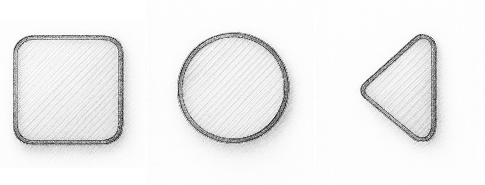

 
 <h2>'ello there 🫡🎩</h2>
  Welcome to my humble GH page. 
  I'm an Android dev based in RU, writing in Kotlin. trudging along towards my goal of <del>landing a job</del> being a full-fledged mobile dev (Kotlin Fullstack with Multi-platform, QA, Design and Team lead competencies)
   
 <h3>🔧⚙️⛏️ Tech Stack</h3>

    Programming Languages	Primary: Kotlin (Native, Advanced)Secondary: Java (Legacy reading/migration)
    Mobile Development	Jetpack Compose, XML Layouts, Android SDK, Single-Activity Architecture, Fragments, ViewPager2
    Architecture & Design Patterns	MVVM, MVI, Clean Architecture, Feature Modules
    Dependency Injection	Hilt, Koin, Dagger 2
    Networking & Data Serialization	Retrofit, OkHttp, Gson, Moshi, Kotlinx Serialization
    Local Storage & Data Management	Room, DataStore, EncryptedSharedPreferences, Paging
    Asynchronous Programming	Kotlin Coroutines, RxJava (Basic)
    Image Loading	Coil, Glide
    UI & Design	Material Design 3, Custom UI Components
    Authentication & Integration	Firebase Authentication, Google OAuth, PayPal Integration
    Analytics	Firebase Analytics, Crashlytics
    Build & Compilation	KSP, Kapt
    Version Control	Git, GitHub, GitLab, Forgejo
    Development Tools	Android Studio/IDEA, Docker
    Backend Exposure	Spring Boot, Ktor
    Additional Skills	CI/CD Processes, Code Review Workflows, API Integration

 <h3>💼✍️🖼️ Portfolio</h3>
    As you can see my GH activity is less than sporadic - I mostly code on private repos in startups (re: my CV, if you are a recruiter that came from a link off of it) to practice real solutions to everyday problems rather than hypotheticals.
    Nonetheless, you can take a look at a few things I've done here and there if you don't mind them being a little dated.
    What I've got pinned: 
     
     #1:<b> Spring Boot tutorial</b> - my foray into Kotlin-based backend via Kotlinlang's tutorial. Which follows it to the T and only diverts to add a failsafe to RANDOM_UUID id gen approach and implements unit-testing
      
     #2:<b> BINTestTask</b> - an app I learned Compose on, which is simultaneously my timed test task for joining a startup. Stack: Compose, MVVM , DI(Koin)&Persistence(Room DB) app working with BIN API through Retrofit+Moshi.
      
     #3:  <b>practicum-android-diploma</b> My first ever team project - MVVM+XML-based module-structure app that fetches job posting from hh.ru. More of a memorabilia at this point, regrettably Stack: XML, MVVM + Feature Modules,  Glide/Retrofit/Koin/NavGraph
      
     #4:  <b>Playlist-Maker</b> My very first Kotlin project - fetches ITunes API's previews to facilitate local storage of tracks w/their meta-data and previews (playable via MediaPlayer) Stack: XML, MVVM,  Glide/Retrofit/Koin/NavGraph

 <h3>🌱📈💪 Current focus</h3>
    Reading: Kotlin in Action (Ktor in Action next!)
     
    Learning: Yandex's algorithm handbook + QA basics on Stepik
     
    Practice: Currently working on a startup with our app in beta-test stage on Google Play Store, nearing its release
     
    Pet project: Once the necessity to pick up the backend and QA basics to better fit the market needs lets up a little I'm going back to my Ktor JWT basic auth app (currently frozen, open but not pinned)

 

  

